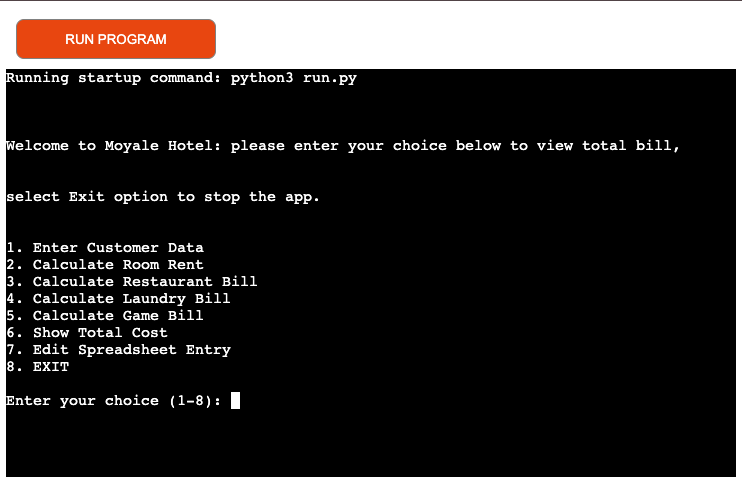
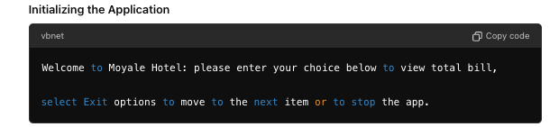
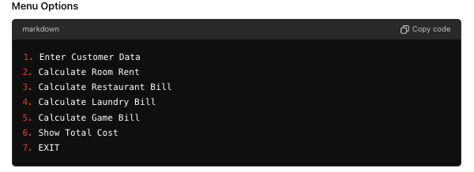
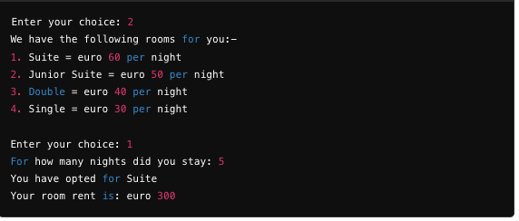
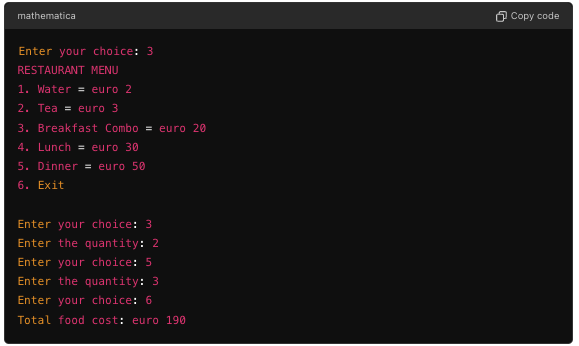
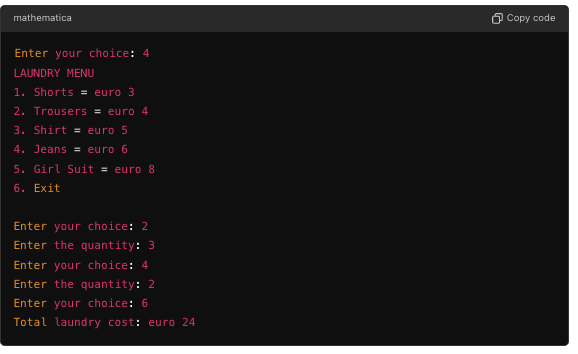
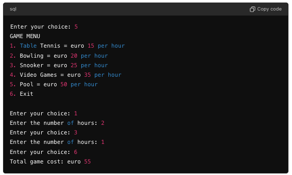
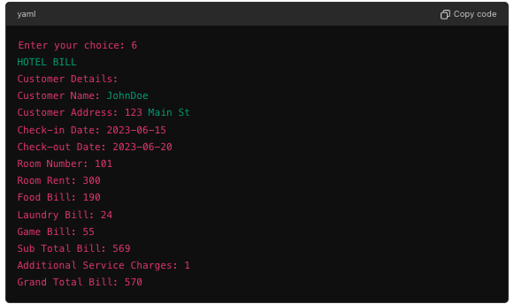
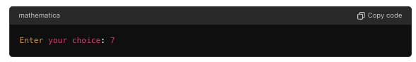
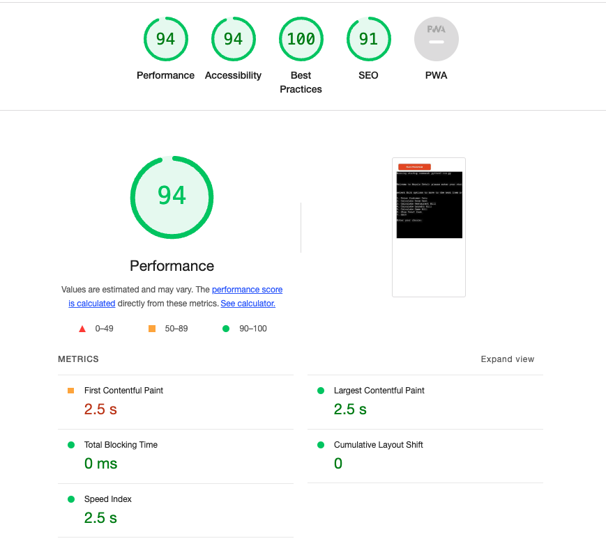

## Hotel Bill 
### Overview
The Hotel Bill Calculator is a Python-based application designed to help hotels manage and calculate customer bills. The application collects customer data, calculates various charges including room rent, restaurant bills, laundry bills, and game bills, and then displays the total bill to the customer. 
 [The deployed app](https://hotelio-48430d90cea4.herokuapp.com/)

The first look of the app simulates the love sandwhiches projects provided in the training module. It is a terminal run app. See below

The app once run initializes and welcomes the users to the app. It shows in writing the CRUD properties of the app.

example:

## UX/UI Design of the Hotel Bill Calculator App
1. User Experience (UX) Considerations:

- __Clarity and Simplicity:__ The app follows a command-line interface (CLI) which ensures that the user is guided through each step with clear instructions. The sequential nature of the inputs helps users stay focused on one task at a time without feeling overwhelmed.

- __Error Handling:__ The app includes robust error handling for invalid inputs, ensuring that users are prompted to correct their mistakes. This prevents frustration and enhances the overall user experience.

- __Feedback:__ Each action, such as entering customer data or calculating a specific bill, provides immediate feedback, reinforcing correct actions and helping users understand the results of their inputs.

- __Consistency:__ The app maintains a consistent format for all input prompts and output displays, making it easier for users to predict how to interact with the system.

2. User Interface (UI) Considerations:

- __Text-Based Interface:__ As a CLI app, the UI is minimalistic, relying on text-based inputs and outputs. This is effective for simplicity and quick navigation through different options.

- __Menu Structure:__ The main menu offers a clear and straightforward list of options, making it easy for users to select the action they want to perform. Sub-menus and prompts are also clearly defined.

- __Readability:__ The text is simple and concise, ensuring that users can easily read and understand the information presented. The use of line breaks and spacing helps to separate different sections of the output for better readability.

### Features
1. __Customer Data Collection:__
Collects customer's name, address, check-in date, and check-out date.
2. __Room Rent Calculation:__ 
Calculates the room rent based on the type of room and the number of nights stayed.
3. __Restaurant Bill Calculation:__ 
Calculates the total cost of food items ordered by the customer.
4. __Laundry Bill Calculation:__ 
Calculates the total cost of laundry services used by the customer.
5. __Game Bill Calculation:__ 
Calculates the total cost of games played by the customer.
6. __Total Bill Display:__ 
Displays a detailed bill including all charges and the grand total. 

## Class and Methods
#### HotelBillCalculator
This is the main class responsible for managing the hotel billing process.

`__init__(self, room_type='', food_bill=0, game_bill=0, laundry_bill=0, total_bill=0, additional_charges=1, customer_name='', customer_address='', check_in_date='', check_out_date='', room_number=101)`
The constructor initializes the class with default or provided values and prints a welcome message.

`input_data(self)`
Collects and validates customer data:

- __customer_name:__ Must not be empty; __NOTE__ didn't validate it to be only letters because in some culture names have numbers to indicate the position the child is born in.
- __customer_address:__ Must not be empty.
- __check_in_date:__ Must be a valid date in the format YYYY-MM-DD and later than 2020-01-01.
- __check_out_date:__ Must be a valid date in the format YYYY-MM-DD and later than 2020-01-01.

1. `get_valid_date(self, prompt)`
Helper method to validate date inputs ensuring they are in the correct format and within the specified range.

2. `calculate_room_rent(self)`
Calculates the room rent based on the type of room selected and the number of nights stayed:

- Suite: €60 per night
- Junior Suite: €50 per night
- Double: €40 per night
- Single: €30 per night
3. `calculate_restaurant_bill(self)`
Calculates the restaurant bill based on the menu items ordered and their quantities:

- Water: €2
- Tea: €3
- Breakfast Combo: €20
- Lunch: €30
- Dinner: €50
4. `calculate_laundry_bill(self)`
Calculates the laundry bill based on the items and their quantities:
- Shorts: €3
- Trousers: €4
- Shirt: €5
- Jeans: €6
- Girl Suit: €8

5. `calculate_game_bill(self)`
Calculates the game bill based on the games played and the number of hours spent:

- Table Tennis: €15 per hour
- Bowling: €20 per hour
- Snooker: €25 per hour
- Video Games: €35 per hour
- Pool: €50 per hour
- display_bill(self)
- Displays the total bill, including all charges and the grand total, along with customer details.

### `main()`
The main function that runs the Hotel Bill Calculator. It provides a menu-driven interface to:

1. Enter customer data
2. Calculate room rent
3. Calculate restaurant bill
4. Calculate laundry bill
5. Calculate game bill
6. Show total cost
7. Exit the application

## Menu Options:
Below is the main option and also will show by emples how the interaction will flow for a user entering data and calculating their bills step-by-step. Each step involves input validation and proper user prompts to ensure correct data entry and accurate bill calculation.
After the hotel management is presented with the menu options as below. They will be able to select the bill they want to calculate at each stage.

1. Enter Customer Data: Collects and validates customer details.

2. Calculate Room Rent: Calculates the room rent based on user input.

3. Calculate Restaurant Bill: Adds items to the restaurant bill based on user input.

4. Calculate Laundry Bill: Adds items to the laundry bill based on user input.

5. Calculate Game Bill: Adds items to the game bill based on user input.

6. Show Total Cost: Displays the detailed bill including all charges.

7. EXIT: Exits the application.
At each stage the user has the option to exit the app with the option to select for exit.

 
 ## Testing
 ### Validator testing
- No error were returned when passing through the official [Etend class Python validator](https://extendsclass.com/python-tester.html) when direct text is used. 

 ### Manual testiing

 #### Browser Compatibility
1. __Google Chrome:__ No issues with appearance, responsiveness, or functionality.
2. __Safari:__ No issues with appearance, responsiveness, or functionality.
3. __Mozilla Firefox:__ No issues with appearance, responsiveness, or functionality.
4. __Microsoft Edge:__ No issues with appearance, responsiveness, or functionality.
 #### Device compatibility
1. __MacBook Pro 13:__ No issues with appearance, responsiveness, or functionality.
2. __iPhone 13 Mini:__ No issues with appearance, responsiveness, or functionality.
3. __iPad 9th Generation:__ No issues with appearance, responsiveness, or functionality.
4. __Iphone 14:__ No issues with appearance, responsiveness, or functionality.
4. __Iphone 15 pro and pro max:__ No issues with appearance, responsiveness, or functionality.
### The Lighthouse Test
The lighthouse testing shows that the app runs well interms of Performance and best practicess is 100%.

## Technologies used
- Python
- Python Libraries
## Framework used
- Git
- Vscode
- Youtube
- Google
- ChatGPT
- Stack-overflow

## Future development
This project will be enhanced in the future by connecting it to a database to ensure we have proper CRUD operations:Create, Read, Update, Delete by connecting it to a databse or even gsheet.
Other functionalities and user friendly UX/UI will be added to using HTML,CSS and JS for scalability.

### Future Functionalities
1. Enhanced Room Selection:

__Room Availability:__ Add functionality to check room availability before booking, integrating with a backend system to manage current reservations.
__Room Upgrades__: Offer room upgrade options based on availability during check-in.

2. Detailed Billing:

- __Itemized Billing:__ Provide detailed itemized bills for each category (room, restaurant, laundry, game) with individual line items.
- __Discounts and Promotions:__ Implement functionality to apply discounts, promotional codes, and special offers.

3. Customer Preferences:
- __Profile Management:__ Allow returning customers to save their preferences and personal information for quicker future bookings.
- __Special Requests__: Enable customers to specify special requests such as extra bedding, dietary requirements, or room amenities.

4. Payment Integration:
- __Online Payment:__ Integrate with online payment gateways to allow customers to pay their bills directly through the app.
- __Payment Methods:__ Offer multiple payment options including credit/debit cards, mobile wallets, and bank transfers.
5. Enhanced UX/UI:
- __Graphical User Interface (GUI):__ Transition from a CLI to a GUI for a more modern and user-friendly experience, using frameworks like Tkinter, PyQt, or a web-based interface.
Multi-Language Support: Provide support for multiple languages to cater to a broader audience.

## Unfixed bugs
No unfixed bugs in the code
## Deployment
The site was deployed to Heroku and can be found here.
The step by step approach to HEROKU deployment can found in the link: [Step by step depolyment on Heroku](https://www.youtube.com/watch?v=rUSjVri4I30)
This site was deployed by completing the following steps:
Log in to Heroku or create an account
On the main page click the button labelled New in the top right corner and from the drop-down menu select Create New App
You must enter a unique app name
Next select your region
Click on the Create App button
The next page is the project’s Deploy Tab. Click on the Settings Tab and scroll down to Config Vars
Click Reveal Config Vars and enter port into the Key box and 8000 into the Value box and click the Add button
Click Reveal Config Vars again and enter CREDS into the Key box and the Google credentials into the Value box
Next, scroll down to the Buildpack section click Add Buildpack select python and click Save Changes
Repeat step 8 to add node.js. o Note: The Buildpacks must be in the correct order. If not click and drag them to move into the correct order
Scroll to the top of the page and choose the Deploy tab
Select Github as the deployment method
Confirm you want to connect to GitHub
Search for the repository name and click the connect button
Scroll to the bottom of the deploy page and select the preferred deployment type
Click either Enable Automatic Deploys for automatic deployment when you push updates to Github

## Credits
### Media
No media taken from external sources.
### Codes
- __stack_overflow:__ validation code taken from stack overflow [validation code](https://stackoverflow.com/questions/53069558/how-to-make-invalid-choice-try-again-print-if-the-user-doesnt-input-one-of-t)
- __YouTube__ idea and inspiration taken from this youtube video which was doing calculator for electricity; 
[YouTube](https://www.youtube.com/watch?v=sbOW1_J79rM)
- __code institute:__ Some validation take from the code institute training materials and love sandwhich projects.
- __ChatGPT and Google__ date validation taken from chatGPT and google.
## Acknowledgements.
I would like to thank:

- My mentor Can Sücüllü for his feedback, advice and guidance in this. Based on Can's recommendation i was able to add validation for check in dates and was able to fix some typo errors and removed other non relevant codes and comments.

- All the CodeInstitute instructors for their comprehensive training and for the tailored made material that enhanced my understanding of the module.
